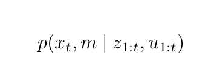
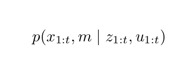
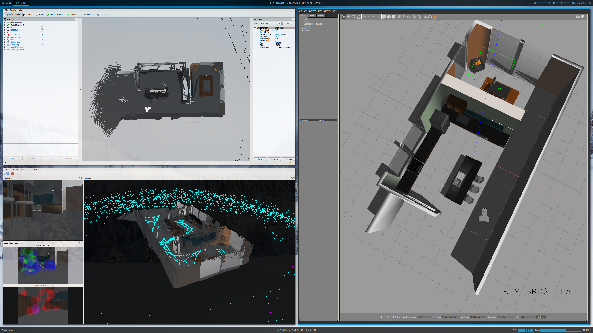
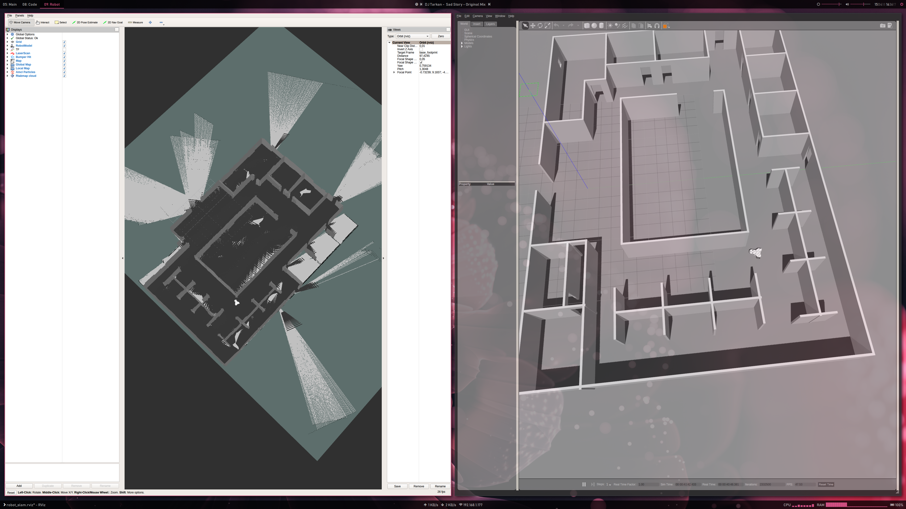
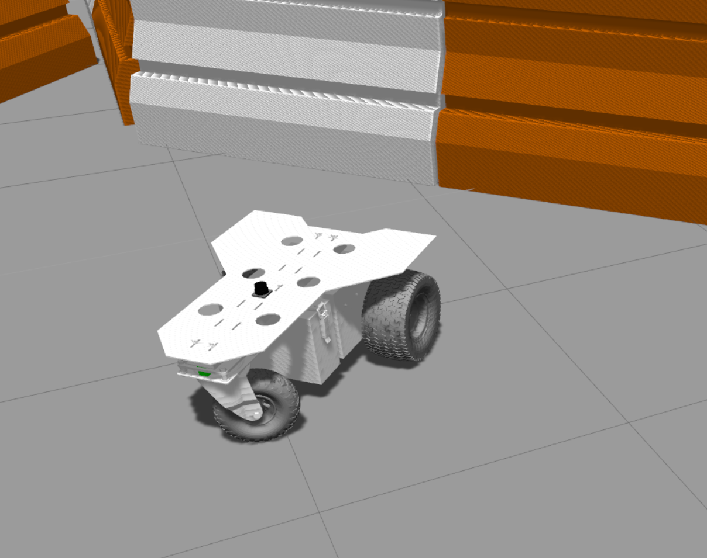
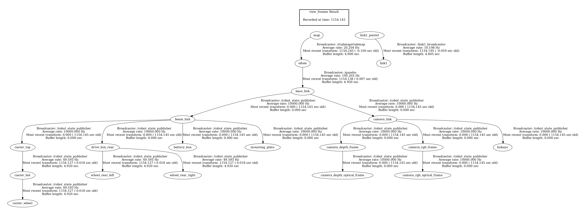
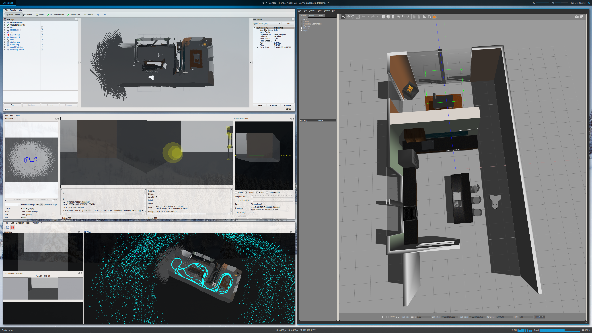
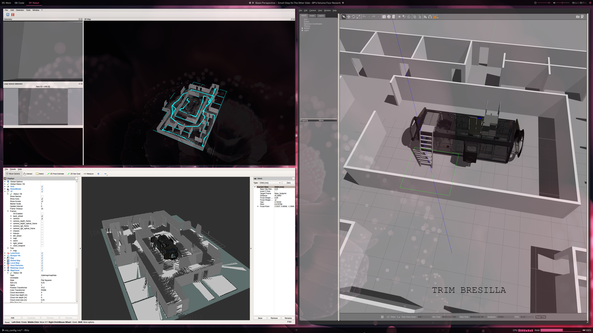
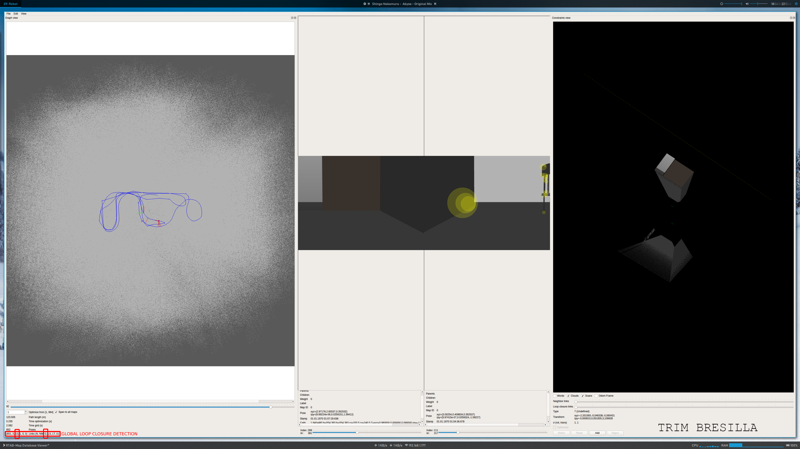

# SLAM with RTAB-Map
## Abstract
This project presents a technique of Simultaneous localization and mapping (SLAM) in a simulated environment using ROS packages like Real-Time Appearance-Based Mapping (RTAB-Map). Robot model, which is build from XARCO files, has sensors like 3D-Camera (eg. Kinect) and/or range finders to map the environment and localize itself based on the measurements. RTABmap shows that is an excellent tool/algorithm to map unknown environments. The performance of the algorithm is tested both in given map and newly generated maps after tweaking some parameters.

## Introduction

One of the most fundamental problems in robotics is the simultaneous localization and mapping problem. This problem is commonly abbreviated as SLAM, and is also known as Concurrent Mapping and Localization. SLAM problems arise when the robot does not have access to a map of the environment; nor does it have access to its own poses [Thrun 2006]. For the robot to map its environment simultaneity and localizing itself on it its a very difficult task. In this project we create a robot model and deploy it firstly in a environment given to us, then we build a new environment from scratch. In both cases, the robot, using RTAB-Map has to map its environment and localize itself on it. It should be able to check for loop closures and match the previous scans with the following scans, by using matching algorithms that come bundled with RTAB-Map ROS package.

## Background
SLAM itself has many forms. From the perspective of probabilistics', it has two very distinctive forms.

First is the online SLAM, an algorithm to estimate the posterior over the momentary pose on the map:

And second is the FullSLAM, another algorithm where posterior over entire map is calculated

While both algorithms are used in different scenarios, the FullSlm is what we are interested and we are going to be working on. The robot is to construct the map and localize while navigating. This is very challenging as because the map is needed for localization and the robot pose is needed for mapping, making the whole problem a goose chase. The data is given by the sensor and odometry information from the start until the current time. However this itself results in two different problems. Determining the map and location during operation of the robot requires  finding the current location as well as the static map. In addition every measurement taken from the sensors has noise, which increases the uncertainty for pose. Since SLAM considers the map as well as the robot pose, there must be some definition of a correct map. In SLAM, maps are defined as sets of objects and a correct map is one that has each object in the correct location [Milstein 2010]. Of course, sensors do not report the location of specific objects, so it is necessary to find which object each sensor reading corresponds to. During years different aproaches and algorithms have been developed to tackle this problem. Most common are:

- Extended Kallman Filter SLAM
- Sparse Extended Information Filter
- Extended Information Filter
- FastSLAM
- GraphSLAM

Both FastSLAM and GraphSLAM are most commonly used approaches to solve FullSLAM form.

#### FastSLAM
The key idea of FastSLAM exploits the fact that knowledge of the robot’s path renders the individual landmark measurements independent by decomposes the SLAM problem into one robot localization problem, and a collection of landmark estimation problems. One of the benefits of FastSLAM [Montemerlo 2002] is that it simultaneously solves both the online and full SLAM problems. 

Even FastSLAM has many derivatives. Being used extensively in field of robotics, many researches have developed different ways for FastSLAM. One being Occupancy Grid FastSLAM. Unlike other SLAM  algorithms, it is possible to  use FastSLAM on an occupancy  grid map directly, without first processing it for landmarks. Since the algorithm  updates the map with reference to a given robot position, the specific representation of the map as Gaussian 
landmarks is not required for it. The only serous problem with this approach is the loop closure detection. Grid  based FastSLAM is performed by combining the MCL particle filtering with the occupancy grid mapping algorithm.  Each particle consists of both the robot's state and an occupancy grid map.

#### GraphSLAM
The same as FastSLAM, GraphSLAM solves the FullSLAM problem by using graphs (hence the name GraphSLAM). GraphSLAM extracts from the data a set of soft constraints, represented by a sparse graph. It obtains the map and the robot path by resolving these constraints into a globally consistent estimate. By using maximum estimation likelihood to optimise the grph, GraphSLAM assigns four different components to the graph: Poses, Features, Motion constrains and Measurement constrains. In this project we utilise a ROS package called RTAB-Map to do the heavy lifting for us. According to the package GitHub repo: TAB-Map (Real-Time Appearance-Based Mapping) is a RGB-D Graph-Based SLAM approach based on an incremental appearance-based loop closure detector. The loop closure detector uses a bag-of-words approach to determinate how likely a new image comes from a previous location or a new location. When a loop closure hypothesis is accepted, a new constraint is added to the map’s graph, then a graph optimizer minimizes the errors in the map.

## Robot Model and the World!

To test SLAM and RTABMap algorithms we use Gazebo as simulator. Gazebo uses XARCO and XML files to describe models of the world and robots. It describes Physics of the enviroiment and robot, it describes the collision and visuals.

In our testing we used two different world models, one made from UDACITY (caffe model) and one made by us (lab model) and tested with our model of robot.

#### Cafe Model

The world of UDACITY is a simple model of an kitchen/dinning/caffe room. It has many household equipment and robot has to move around while mapping and localizing itself using the mounted sensors. The room, is divided in two, and in both sides have an objects in the middle, making it quiet good for loop closures. Since there are a lot of elements in the kitchen, robot might have easier to create landmark points and match them easier based on uniqueness of those elements.

#### Lab Model

Our model is based on real mapping of out labs/offices. The model is quiet big and its 1:1 representative of the real object. The elements of the office are removed, only walls are left (except the workshop located in the meddle). This is done for two reasons: one, it uses less memory for the simulation, and second, it is good to demonstrate how many loops it needs to do, to find an actual loop closure.

#### Rover Model

Rover model is the same as the previous project's model, with some slight modification in sensor suite. The model is made modular in different XARCO file, in this way, we can easily switch from three wheeled robot to four wheeled robot (with only one line of code).

The robot represents the real robot that we are building. It is 0.55 cm long, 0.3 width and 0.25 cm heigh. It is foreseen to handle an robotic arm, to be an completely mobile manipulator arm. Our internal goal is to make an apple harvesting robot. 

On the front of the robot there is mounted a KINECT camera for simulation (in reality we are using RealSense). The camera angle is 15° up from the horizontal axis. In top of the robot, there is an 2D laser scan camera with an 260° view of the front. 

Here is the complete ROS graph of each topic and their relation:

## Results

The base navigation tack is manual. The keyboard sends keystroke messages to the teleop node for the direction and speed. When the world and model are launched, the RGB-D camera starts sending RAW data to the RTABMap node for further processing. As the first keystroke is hold down, the robot moves and new frames are acquired and send to the RTABMap.

In our case, the robot model dimensions were a bit big to freely move everywhere in the room. However after few cycles and loops, the RTABMap was able to reconstruct all the room into 3D points. During this time, several loop closures were observed. (the whole poses database is linked at the end of this WRITEUP)

The same happened with the map created by us of our office. The difference was that, since we decided not to put many elements in the object, it was harder for the robot to find loop closures. However after some amount of time and some amount of RAM memory usage, the robot starts finding loop closures.

## Future Work
RTABMap shows that is very powerful tool to solve FullSLAM problem. In addition, it shows that even with one simple 3D camera, SLAM can be achieved. However to use only 3D camera and not the range sensor, there should be added another package that converts points of RGB-D camera into ranges and distances. This has its drawbacks, like the precision and accuracy of the points.

## POSES DATABASE
https://1drv.ms/u/s!AqM4RXzOdEqwi6oHmX_xexRvEobMAg