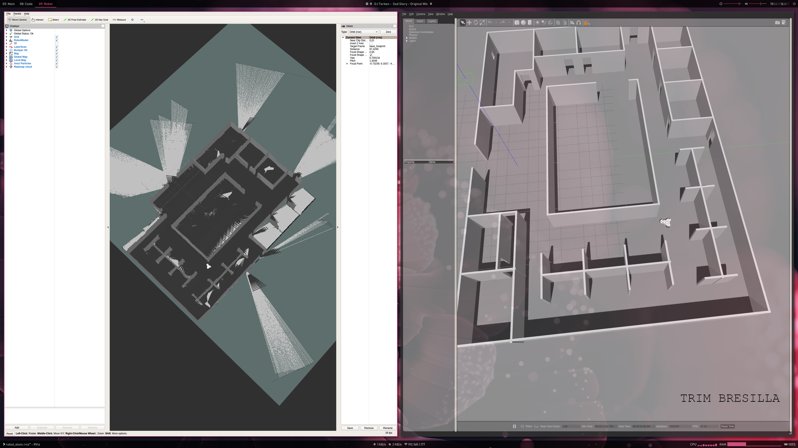

# SLAM with RTAB-Map
## Abstract
This project presents a technique of Simultaneous localization and mapping (SLAM) in a simulated environment using ROS packages like Real-Time Appearance-Based Mapping (RTAB-Map). Robot model, which is build from XARCO files, has sensors like 3D-Camera (eg. Kinect) and/or range finders to map the environment and localize itself based on the measurements. RTABmap shows that is an excellent tool/algorithm to map unknown environments. The performance of the algorithm is tested both in given map and newly generated maps after tweaking some parameters.

## Introduction

One of the most fundamental problems in robotics is the simultaneous localization and mapping problem. This problem is commonly abbreviated as SLAM, and is also known as Concurrent Mapping and Localization. SLAM problems arise when the robot does not have access to a map of the environment; nor does it have access to its own poses [Thrun 2006]. For the robot to map its environment simultaneity and localizing itself on it its a very difficult task. In this project we create a robot model and deploy it firstly in a environment given to us, then we build a new environment from scratch. In both cases, the robot, using RTAB-Map has to map its environment and localize itself on it. It should be able to check for loop closures and match the previous scans with the following scans, by using matching algorithms that come bundled with RTAB-Map ROS package.

## Background
SLAM itself has many forms. From the perspective of probabilistics', it has two very distinctive forms.

First is the online SLAM, an algorithm to estimate the posterior over the momentary pose on the map:

And second is the FullSLAM, another algorithm where posterior over entire map is calculated

While both algorithms are used in different scenarios, the FullSlm is what we are interested and we are going to be working on. The robot is to construct the map and localize while navigating. This is very challenging as because the map is needed for localization and the robot pose is needed for mapping, making the whole problem a goose chase. The data is given by the sensor and odometry information from the start until the current time. However this itself results in two different problems. Determining the map and location during operation of the robot requires  finding the current location as well as the static map. In addition every measurement taken from the sensors has noise, which increases the uncertainty for pose. Since SLAM considers the map as well as the robot pose, there must be some definition of a correct map. In SLAM, maps are defined as sets of objects and a correct map is one that has each object in the correct location [Milstein 2010]. Of course, sensors do not report the location of specific objects, so it is necessary to find which object each sensor reading corresponds to. During years different aproaches and algorithms have been developed to tackle this problem. Most common are:

- Extended Kallman Filter SLAM
- Sparse Extended Information Filter
- Extended Information Filter
- FastSLAM
- GraphSLAM

Both FastSLAM and GraphSLAM are most commonly used approaches to solve FullSLAM form.

#### FastSLAM
The key idea of FastSLAM exploits the fact that knowledge of the robot’s path renders the individual landmark measurements independent by decomposes the SLAM problem into one robot localization problem, and a collection of landmark estimation problems. One of the benefits of FastSLAM [Montemerlo 2002] is that it simultaneously solves both the online and full SLAM problems. 

Even FastSLAM has many derivatives. Being used extensively in field of robotics, many researches have developed different ways for FastSLAM. One being Occupancy Grid FastSLAM. Unlike other SLAM  algorithms, it is possible to  use FastSLAM on an occupancy  grid map directly, without first processing it for landmarks. Since the algorithm  updates the map with reference to a given robot position, the specific representation of the map as Gaussian 
landmarks is not required for it. The only serous problem with this approach is the loop closure detection. Grid  based FastSLAM is performed by combining the MCL particle filtering with the occupancy grid mapping algorithm.  Each particle consists of both the robot's state and an occupancy grid map.

#### GraphSLAM
The same as FastSLAM, GraphSLAM solves the FullSLAM problem by using graphs (hence the name GraphSLAM). GraphSLAM extracts from the data a set of soft constraints, represented by a sparse graph. It obtains the map and the robot path by resolving these constraints into a globally consistent estimate. By using maximum estimation likelihood to optimise the grph, GraphSLAM assigns four different components to the graph: Poses, Features, Motion constrains and Measurement constrains. In this project we utilise a ROS package called RTAB-Map to do the heavy lifting for us. According to the package GitHub repo: TAB-Map (Real-Time Appearance-Based Mapping) is a RGB-D Graph-Based SLAM approach based on an incremental appearance-based loop closure detector. The loop closure detector uses a bag-of-words approach to determinate how likely a new image comes from a previous location or a new location. When a loop closure hypothesis is accepted, a new constraint is added to the map’s graph, then a graph optimizer minimizes the errors in the map.

## Robot Model and the World!

#### Cafe Model

#### Lab Model

#### Rover Model

## Results

## POSES DATABASE
https://1drv.ms/u/s!AqM4RXzOdEqwi6oHmX_xexRvEobMAg